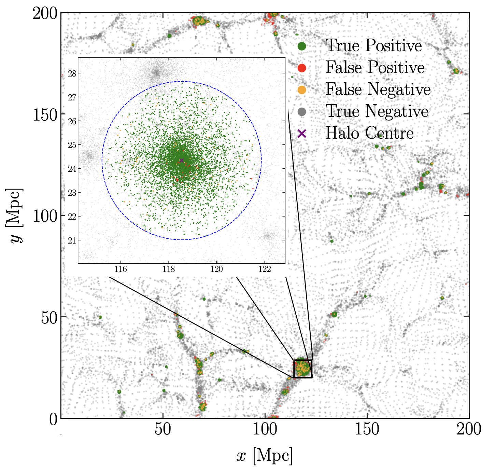

# CNN+FoF: application of deep learning to the identification of dark matter haloes

[](https://arxiv.org/abs/2602.21246)
[](LICENSE)
[](https://www.python.org/)
[](https://pytorch.org/)

A volumetric Convolutional Neural Network to classify individual simulation particles as either halo or non-halo members, followed by a highly optimised and parallelised Friends-of-Friends clustering algorithm that groups the classified halo members into distinct haloes.

> **Maiti S., Correa C. M., Fiorilli A., Ruiz A. N., Paz D. J., Pérez Fernández A., Sánchez A. G.**  
> *CNN+FoF: application of deep learning to the identification of dark matter haloes*, MNRAS (2026)


---

## Dark Matter Halo

Spatial distribution of particles in one of the $L200-N128^{3}$ test simulations, colour-coded by classification category: true positives (green), false positives (red), false negatives (orange), and true negatives (grey). The main panel displays a projected slice (depth of $2.5%$ of the box size) illustrating the large-scale cosmic web.
The inset zooms in on a representative halo identified by $\texttt{ROCKSTAR}$, with the centre marked by a purple cross and the $r_{200\mathrm{b}}$ radius indicated by a dashed blue circle.



---


## Overview of the Repo

This repository provides the core scientific ingredients underlying the CNN+FoF pipeline:

**Core algorithm & model:**
- **`Model.py`**: Full architecture used for the work

- **`models/`**: Pre-trained PyTorch `.pth` models for different resolution configurations amnd mass definition tested:
  - $L200-N64^{3}$
  - $L200-N128^3$
  - $L93.75-N128^{3}$

**Friends-of-Friends clustering:**
- **`voxcel_fof/`**: Optimised C++ implementation of our optimised and parallelised Friends-of-Friends algorithm.

**Data I/O & utilities:**
- **`gadget4_reader.py`**: Standalone GADGET-4 snapshot reader. Handles unit conversion (Mpc/h → Mpc, comoving → physical velocities) and exports to `.npz` or ASCII.

---

## Requirements

```
Python      >= 3.10
PyTorch     >= 2.0
NumPy
SciPy
pandas
Matplotlib
```

Install dependencies:

```bash
pip install torch numpy scipy pandas matplotlib
```

Build the FoF executable:

```bash
cd voxcel_fof/
make
```

---

## Data

Simulations were generated with [GADGET-4](https://gitlab.mpcdf.mpg.de/vrs/gadget4) assuming a flat ΛCDM cosmology at $z=0$. Ground-truth halo labels were obtained from [ROCKSTAR](https://bitbucket.org/gfcstanford/rockstar/src/main/).

Four resolution configurations were used:

| Configuration  | $m_p \ [M_\odot]$      | $N_\mathrm{particles}$ |
|----------------|------------------------|------------------------|
| L200-N32³      | $4.35 \times 10^{12}$  | $32{,}768$             |
| L200-N64³      | $5.44 \times 10^{11}$  | $262{,}144$            |
| L200-N128³     | $6.80 \times 10^{10}$  | $2{,}097{,}152$        |
| L100-N128³     | $8.50 \times 10^{9}$   | $2{,}097{,}152$        |

The input to the network is a 6-channel voxelised tensor per particle:

$$X \in \mathbb{R}^{N_\mathrm{res} \times N_\mathrm{res} \times N_\mathrm{res} \times 6}$$

comprising the three displacement field components $(\Psi_x, \Psi_y, \Psi_z)$ and three velocity components $(v_x, v_y, v_z)$.

---

## Model Architecture

The classification network is a 3D VNet (encoder–decoder with skip connections), adapted for binary particle classification:

```
Input (6 channels)
    │
    ├─ Conv3D 6→64  ×2          [stride 1, periodic padding]
    │       │
    ├─ Conv3D 64→128            [stride 2, downsample]
    │       │
    ├─ Conv3D 128→128  ×2
    │       │
    ├─ Conv3D 128→256           [stride 2, downsample]
    │       │
    ├─ Conv3D 256→256  ×2       [bottleneck]
    │       │
    ├─ ConvTranspose3D 256→128  [upsample + skip connection]
    │       │
    ├─ Conv3D 256→128  ×2       [after concat]
    │       │
    ├─ ConvTranspose3D 128→64   [upsample + skip connection]
    │       │
    ├─ Conv3D 128→64  ×2        [after concat]
    │       │
    └─ Conv3D 64→1 + Sigmoid
            │
        Output: halo probability ∈ [0, 1] per particle
```

| Parameter           | Value                             |
|---------------------|-----------------------------------|
| Input channels      | 6 (displacement + velocity)       |
| Output channels     | 1 (halo probability)              |
| Trainable params    | ~8.4 × 10⁶                        |
| Loss function       | Binary cross-entropy (BCE)        |
| Optimiser           | Adam, lr = 10⁻³                   |
| Max epochs          | 120 (early stopping on val. loss) |
| Classification threshold | 0.498                        |


## Results

### Particle classification (L100-N128³)

| Metric      | Value  |
|-------------|--------|
| Accuracy    | 0.99   |
| Precision   | 0.98   |
| Recall      | 0.98   |
| F1 Score    | 0.98   |
| AUC         | 0.99   |

### Halo catalogue (L100-N128³, $M_{200b}$)

| Metric       | Value   |
|--------------|---------|
| Purity       | 99.38%  |
| Completeness | 89.34%  |
| HMF agreement| < 5%    |

### Computational speed-up

The CNN+FoF pipeline achieves a consistent speed-up of approximately one order of magnitude relative to ROCKSTAR across all tested resolutions, with runtime ratios ranging from 8× to 12×.

---

## Citation

If you use this code in your research, please cite:

```bibtex
@ARTICLE{2026arXiv260221246M,
       author = {{Maiti}, Soumadeep and {Correa}, Carlos M. and {Fiorilli}, Andrea and {Ruiz}, Andr{\'e}s N. and {Paz}, Dante J. and {P{\'e}rez Fern{\'a}ndez}, Alejandro and {S{\'a}nchez}, Ariel G.},
        title = "{CNN+FoF: application of deep learning to the identification of dark matter haloes}",
      journal = {arXiv e-prints},
     keywords = {Cosmology and Nongalactic Astrophysics, Astrophysics of Galaxies},
         year = 2026,
        month = feb,
          eid = {arXiv:2602.21246},
        pages = {arXiv:2602.21246},
          doi = {10.48550/arXiv.2602.21246},
archivePrefix = {arXiv},
       eprint = {2602.21246},
 primaryClass = {astro-ph.CO},
       adsurl = {https://ui.adsabs.harvard.edu/abs/2026arXiv260221246M},
      adsnote = {Provided by the SAO/NASA Astrophysics Data System}
}
```

---

## Acknowledgements

This work was carried out on the HPC system Raven at the [Max Planck Computing and Data Facility (MPCDF)](https://www.mpcdf.mpg.de) in Garching, Germany. Supported by the Excellence Cluster ORIGINS, funded by the Deutsche Forschungsgemeinschaft (DFG) under Germany's Excellence Strategy — EXC-2094 — 390783311.
